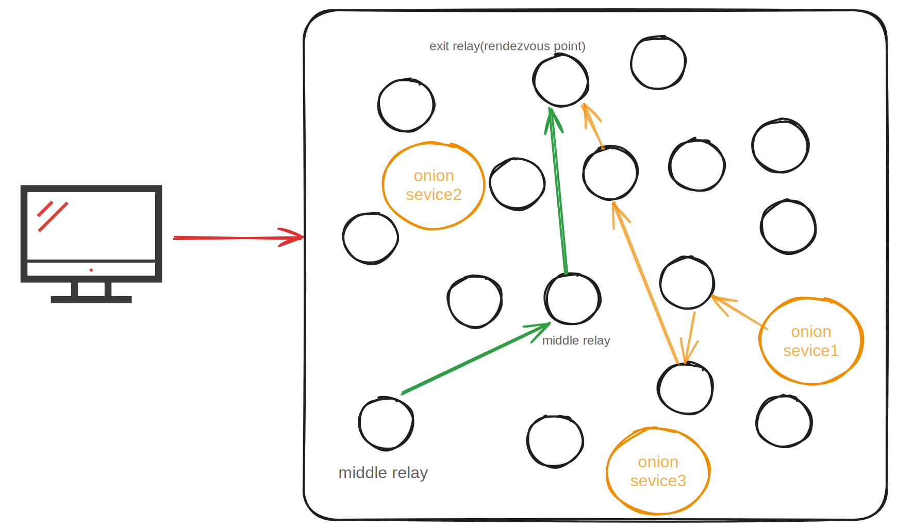
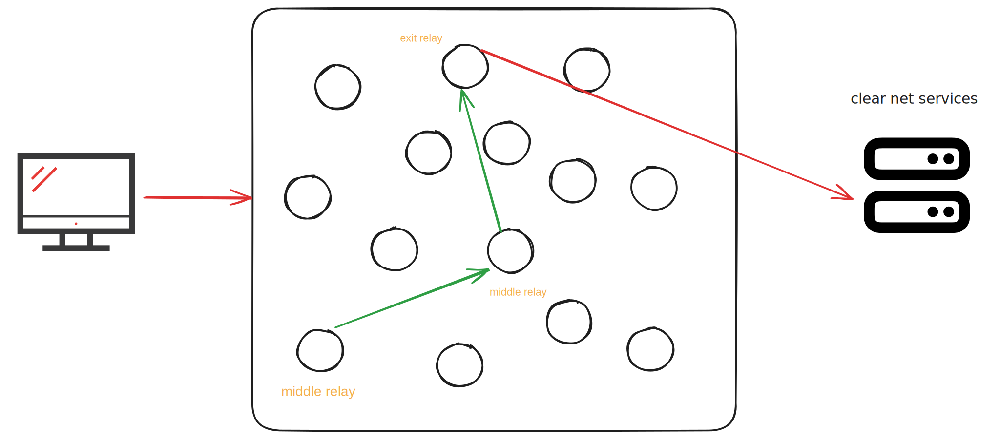
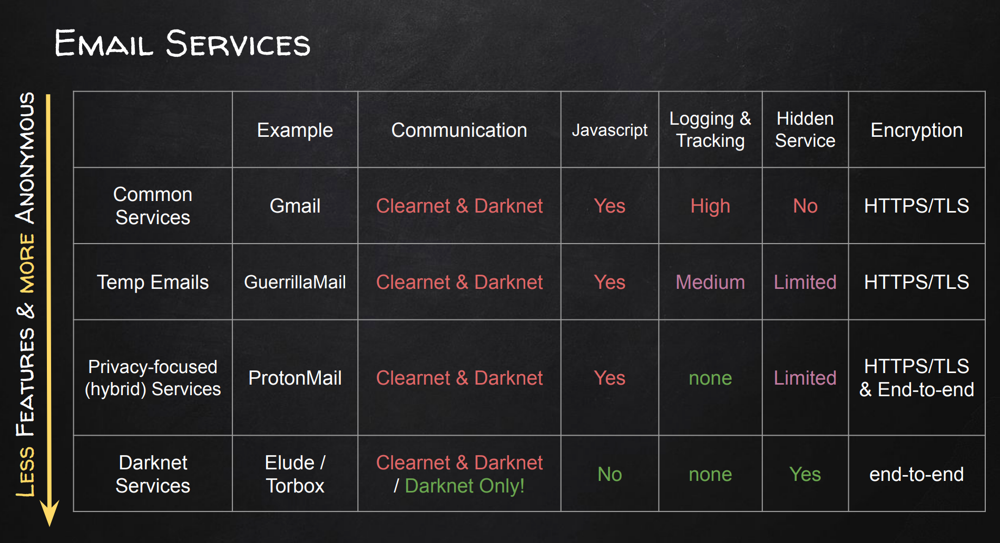
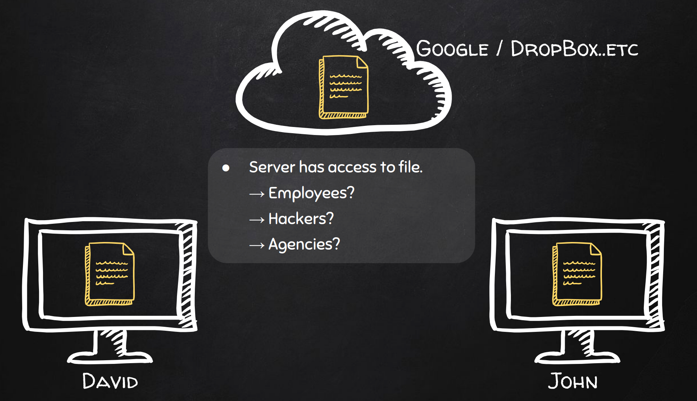
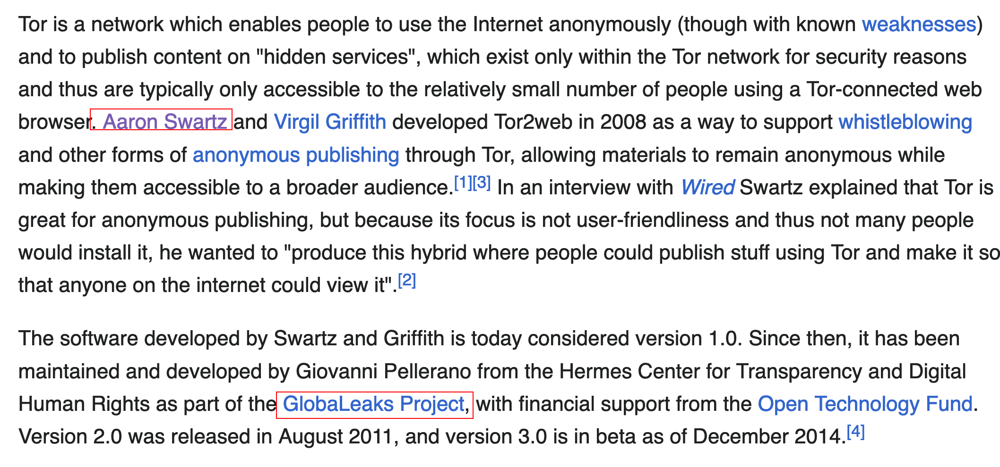

# The Onion Router(Tor) Network

## What is Tor?

> Tor is a program you can run on your computer that helps keep you safe on the Internet. It protects you by bouncing your communications around **a distributed network of relays** run by volunteers all around the world: it prevents somebody watching your Internet connection from learning what sites you visit, and it prevents the sites you visit from learning your physical location. This set of volunteer relays is called the Tor network.
>
> source: https://support.torproject.org/about/what-is-tor/

1. Network of servers designed to improve anonymity and privacy. 
2. Most common anonymizing network. 
3. Connected computers can be configured to offer hidden/onion services. 
4. Onion routing was designed by the US army to protect their communications.

## How does Tor work?

https://community.torproject.org/onion-services/overview/

### For clients

1. clients connect to the tor network

2. find the onion address (.onion is the address of Onion Service) / or a clear net address 

3. If the address is an onion address inside the tor network

    1. Client goes to a  *distributed hash table*  where all onion services' descriptors are stored and ask for the signed descriptor of this  onion service, and verify the signature of the descriptor using the public key that is encoded in the onion address, this provides the *end-to-end authentication* security 

    2. Inside the descriptor, there are the **introduction points** that allow the client to introduce themselves to onion services.

    3. > Before the introduction takes place, the client (in this case, you) picks **a Tor relay** and establishes a circuit to it. The client asks the relay to become their rendezvous point and give it an "one-time secret" that will be used as part of the rendezvous procedure.

    4. The introduction point passes your details (secret string and rendezvous address) on to the Onion Service, which runs multiple verification processes to decide whether you're trustworthy or not.

    5. The Onion Service connects to the rendezvous point (through an anonymized circuit) and sends the "one-time secret" to it. The **rendezvous point** makes one final verification to match the secret strings from you and service (the latter also comes from you but has been relayed through the service).

    

4. if the address is a clear net address

> [!NOTE]
>
> **Relays**
>
> There are three kinds of relays that you can run in order to help the Tor network: **middle relays, exit relays, and bridges**.
>
> People who run **exit relays** should be prepared to deal with complaints,  copyright takedown notices, and the possibility that their servers may  attract the attention of law enforcement agencies. 
>
> **Bridges** are Tor relays which are not publicly listed as part of  the Tor network. Bridges are essential censorship-circumvention tools in countries that regularly block the IP addresses of all publicly listed  Tor relays. A bridge is generally safe to run in your  home, in conjunction with other services, or on a computer with your  personal files.

### For onion/hidden services

1. As the first step in the protocol, the Onion Service will contact a bunch of Tor relays and ask them to act as its ***introduction points*** by establishing long-term circuits to them. These circuits are anonymized circuits, so the server does not reveal the service location to the introduction points.
2. The Onion Service will hide and protect itself behind the Tor network by only allowing access through three introduction points that it connects to through a three-hop Tor circuit.
3. Once introduction points are set up, then it comes with how the client could find the Onion services
    1. For this reason, the Onion Service assembles an ***Onion Service descriptor***, containing a list of its introduction points (and "authentication keys"), and signs this descriptor with the Onion Service's *identity private key*. The *identity private key* used here is the private part of the **public key that is encoded in the Onion Service address**.
    2. The Onion Service uploads that signed descriptor to a *distributed hash table*, which is part of the Tor network, so that clients can also get it. It uses an anonymized Tor circuit to do this upload so that it does not reveal its location.

>
> In general, the complete connection between client and Onion Service consists of **6 relays**: 3 of them were picked by the client, with the third being the rendezvous point, and the other 3 were picked by the Onion Service. This provides *location hiding* to this connection.

## Example Onion Services

https://community.torproject.org/onion-services/talk/

### Using Email

1. Use a temporary email service. 
    - Temporary email account with an expiry date. 
    - No setup. 
    - No personal information required. 
    - Lost of services on the **clearnet and darknet**.
2. Use a more private email service  -> **ProtonMail**
    1. No tracking. 
    2. No logs.
    3.  End-to-end encryption. 
    4.  No personal information required. 
    5. Available on the clearnet and as an onion service. 
    6. Send emails to clearnet and darknet addresses!
3. User a Darknet email service.

### Instant Messaging

**XMPP/Jabber**

1. Features:
    1. A more private instant messaging service 
    2. Free & open. 
    3. Not owned by anyone. 
    4. Decentralized. 
    5. Useable through Pidgin messenger in Tails. 
    6. Enhance privacy using OTR. 
    7. Widely used on the darknet
2. XMPP Server list
3. Pidgin and Adium with OTR (Off The Record) plugin

### File Transfering 

**What makes file transferring not secure?**

1. Each file has metadata. 
    - Metadata provides info about the file such as: 
        - The creator. 
        -  Program used to create it. 
        - Time it was created. 
        - And more!
2. Google drive, Dropbox icloud…. etc are not private, Not secure, they have log data & track users….etc.

**How to send files more privately?**

1. remove the metadata, like [Metadata Cleaner](https://metadatacleaner.romainvigier.fr/) and [mat2](https://0xacab.org/jvoisin/mat2) preinstalled in Tails https://tails.net/doc/sensitive_documents/metadata/index.en.html
2. OnionShare -> file transferring service based on tor
    - Peer-to-peer. 
    - Files stored locally. 
    - End-to-end encryption. 
    -  More private. 
    -  Benefits from the TOR Network’s anonymity.
3. Erase instead of deleting files from your storage drive
    - Deleted files can be recovered.
    - Deleting a file only marks its location as available.
    - https://tails.net/doc/encryption_and_privacy/secure_deletion/index.en.html#overwrite

### Encryption 

Although Tor provides us with some level of anonymity and security, we can use our own encryption tools to encrypt and sign files.

PGP - Pretty Good Encryption 

### Cryptocurrency

Bitcoin & Monero

How to create your wallet? 

How to get bitcoins anonymously?

How to send and receive bitcoins?

What is Mixers/Tumblers ?

What's the difference between Bitcoin and Monroe?

## How to get access to Tor?

### Using own custom configurations

configure your computer to route all traffic through the tor network -> leads to internet speed drop/information leak /potential data un-encrypted and leak

### Tor Browser

Tor Browser is a version of Firefox that fixes many privacy issues. You can read more about Tor on our [about](https://www.torproject.org/about/history/) page.

### Tor2web

https://en.wikipedia.org/wiki/Tor2web

### Other operating systems

Tail

Qube OS

Whonix

Parrot OS

## How to get access to Onion Services

1. Use Darknet Search engines over tor: DuckDuckGo / NotEvil / Torch 
2. Using Listings & Onion Services : hidden wiki / reddit 

## See also

1. https://en.wikipedia.org/wiki/Tor_(network) wikipedia
2. https://www.udemy.com/course/the-ultimate-dark-web-anonymity-privacy-security-course/?couponCode=LETSLEARNNOW  udemy course link
